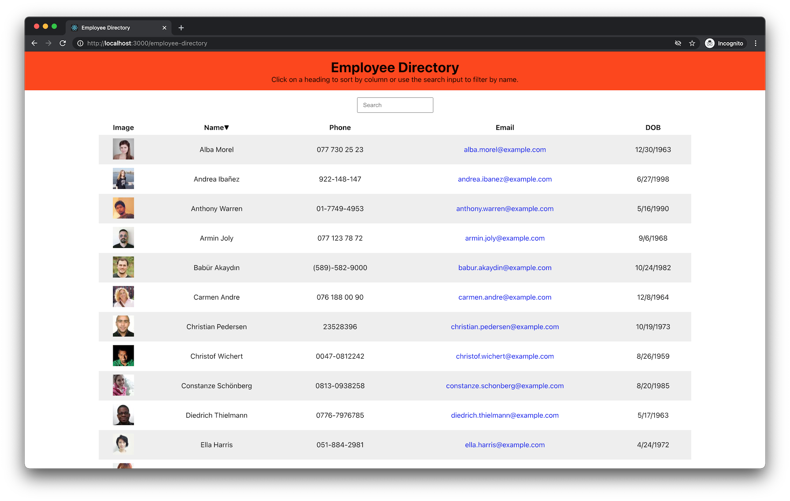

# Employee Directory
[](https://opensource.org/licenses/MIT)

## Description
A simple web app that displays a table of relevant employee information built to learn and practice react.

## Table of Contents
* [Installation](#installation)
* [Usage](#usage)
* [License](#license)
* [Contributing](#contributing)
* [Tests](#tests)
* [Questions](#questions)

## Installation
```
clone the repo to your local machine.
cd into directory
npm install
```

## Usage
```
npm start
```

## License
[MIT](https://opensource.org/licenses/MIT)

## Contributing
No contributions at this time.

## Tests
```
No tests.
```

## Questions
If you have any questions you can reach out to me on [Github](https://github.com/brhue) or shoot me an [email](mailto:).
